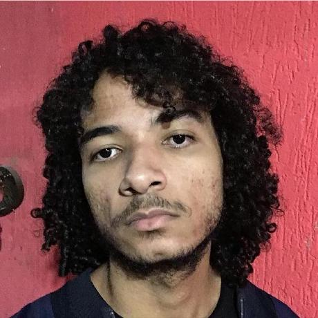

# Sobre
Este documento tem a inteção de servir como Wiki do projeto Brasfoot, na
matéria Sistema de Bancos de Dados 1, Universidade de Brasília, Faculdade
do Gama, semestre letivo 2022.1.

### Link da Wiki
[Wiki Brasfoot SBD 2022.1]()

## Brasfoot
No Brasfoot você comanda um time de futebol, compra e vende jogadores,
define o preço dos ingressos, escolhe as táticas e participa dos campeonatos
que simulam a realidade. O jogo é super leve, e várias temporadas podem
ser jogadas de forma rápida e divertida!

# Integrantes
Abaixo segue tabela com os integrantes do projeto e as suas reespectivas informações:

|        |  |  |  |
|--------|:----------------------------------------------------------------------------------------:|:----------------------------------------------------------------------------------------:|:------------------------------------------------------------------------------------------:|
| Nome   |                                      Paulo Gontijo                                       |                                        Daniel Oda                                        |                                     Matheus Clementes                                      |
| Github |                   [paulohgontijoo](https://github.com/paulohgontijoo)                    |                        [danieloda](https://github.com/danieloda)                         |                   [matheusclemente](https://github.com/matheusclemente)                    |
