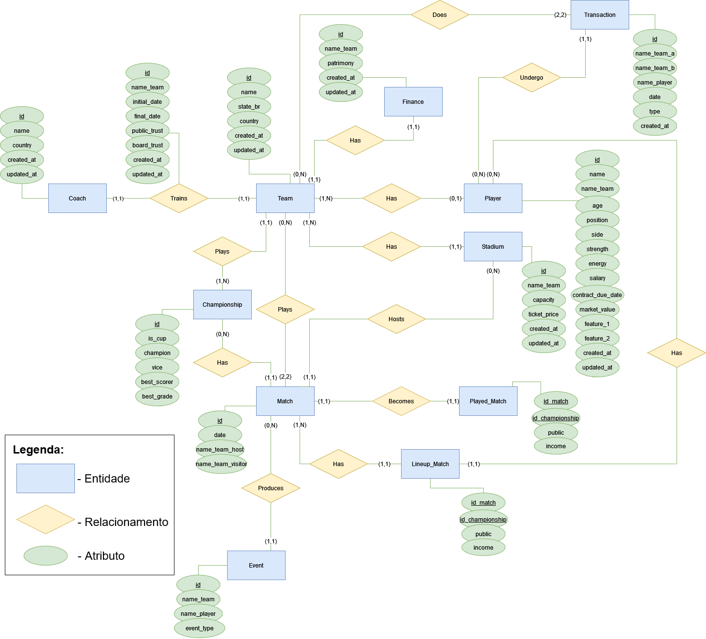
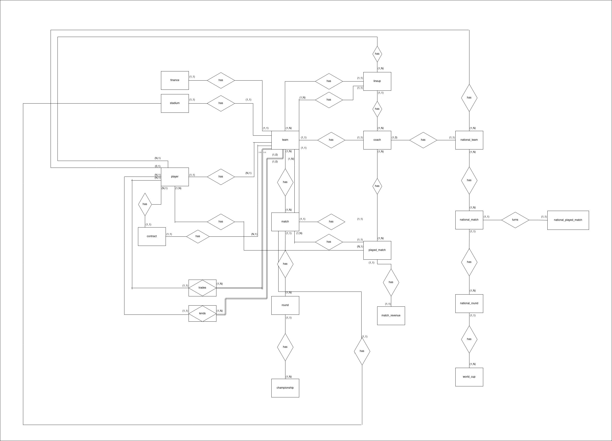

# MER

|    Data    | Versão |                    Descrição                    |           Autor           |
| :--------: | :----: | :---------------------------------------------: | :-----------------------: |
| 03/07/2022 |  0.1   |               Início do Documento               | Daniel Oda, Paulo Gontijo |
| 05/09/2022 |  0.2   | Reformatação do documento; adição de hyperlink. |       Paulo Gontijo       |
| 11/09/2022 |  1.0   |             Atualização do diagrama             |     Matheus Clemente      |

## O que é?

O MER (Modelo Entidade Relacionamento) é utilizado para descrever os objetos do mundo real através de **entidades**,
que possuem **atributos** e **relacionamentos** para descrever suas propriedades e, desssa forma, representar os
aspectos estáticos do Domínio da Aplicação.

O DER (Diagrama Entidade-Relacionamento) é utilizado para representar em forma gráfica o que foi descrito no MER
(Modelo Entidade Relacionamento).

## Diagrama Entidade-Relacionamento

A figura abaixo refere-se ao artefato diagrama, referenciado no título:

<h6 align='center'>Figura 1: diagrama de entidades e relações</h6>

É possível acessá-lo diretamente em nosso [repositório](https://github.com/SBD1/grupo7-brasfoot/blob/e1e2a4a7cdbb9df660be10779544b1b9dc8cdfa7/docs/images/DER_BRASFOOT_V2.drawio.png).

## Versões anteriores

### Módulo 1

<h6 align='center'>Figura 2: primeira versão do diagrama de entidades e relações</h6>

## Referências Bibliográficas

> [Google Academy](https://sites.google.com/site/uniplibancodedados1/aulas/modelo-relacional), acessado em 4 de Julho de 2022.
