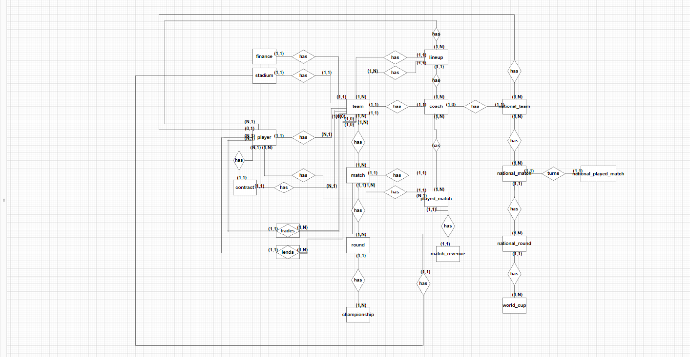

# MER

|    Data    | Versão | Descrição | Autor |
| :---: | :----: | :---: | :---: |
| 03/07/2022 | 0.1 | Início do Documento | [Daniel Oda](https://github.com/danieloda) |

## O que é?

O MER (Modelo Entidade Relacionamento) é utilizado para descrever os objetos do mundo real através de  **entidades**, que possuem  **atributos**  e  **relacionamentos**  para descrever suas propriedades e, desssa forma, representar os aspectos estáticos do Domínio da Aplicação.

O DER (Diagrama Entidade-Relacionamento) é utilizado para representar em forma gráfica o que foi descrito no MER (Modelo Entidade Relacionamento).

## Diagrama Entidade-Relacionamento

