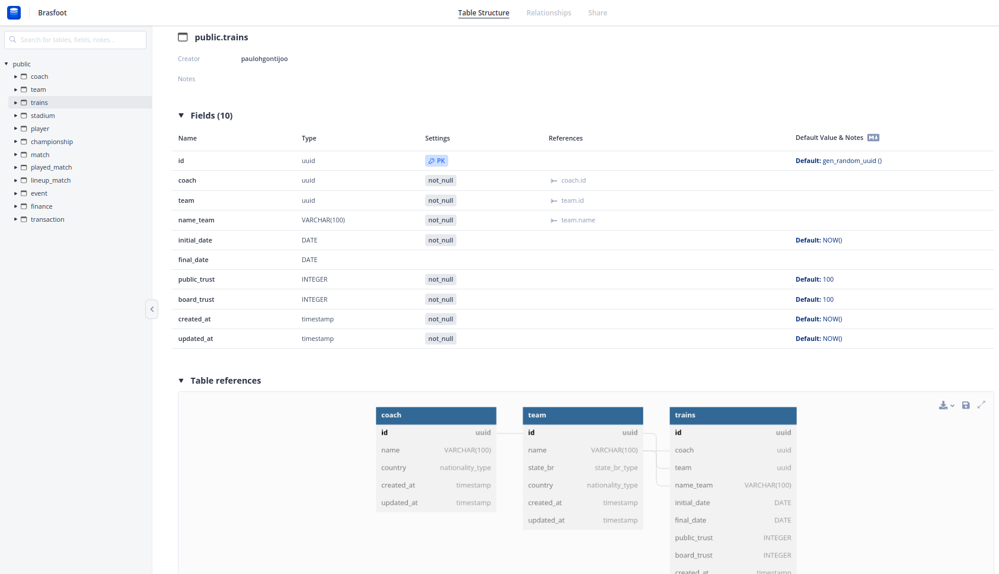

# Modelo Relacional

|    Data    | Versão |                Descrição                 |      Autor       |
| :--------: | :----: | :--------------------------------------: | :--------------: |
| 03/07/2022 |  0.1   |           Início do Documento            |    Daniel Oda    |
| 04/07/2022 |  0.2   |           Revisão do Documente           | Matheus Clemente |
| 05/09/2022 |  0.3   | Atualização MREL; Ajustes de formatação. |  Paulo Gontijo   |
| 11/09/2022 |  0.4   |          Revisão de formatação.          | Matheus Clemente |

## O que é?

O MREL (Modelo Relacional) é utilizado para apoiar a implementação das aplicações, apresentando um projeto lógico de como as entidades e relacionamentos serão mapeadas no SGBD, porém é um modelo lógico não atrelado a algum SGBD específico.

## Entidades

<h6 align='center'>Figura 1: diagrama de entidades e relações</h6>

As próximas sub-seções dizem respeito às entidades presentes em toda aplicação. Serão demonstrados fragmentos da documentação,
a título de introdução. O artefato completo pode ser acessado por intermédio deste link:

- [Dbdocs.io](https://dbdocs.io/paulohgontijoo/Brasfoot)

> _Aconselhamos a análise do artefato pelo link, disponibilizado acima._

### coach

A figura a seguir mostra as informações a respeito da entidade **coach**:

<h6 align='center'>Figura 2: detalhamento entidade coach</h6>

### team

A figura a seguir mostra as informações a respeito da entidade **team**:

<h6 align='center'>Figura 3: detalhamento entidade team</h6>

### trains

A figura a seguir mostra as informações a respeito da entidade **trains**:

<h6 align='center'>Figura 4: detalhamento entidade trains</h6>

### stadium

A figura a seguir mostra as informações a respeito da entidade **stadium**:

<h6 align='center'>Figura 5: detalhamento entidade stadium</h6>

### player

A figura a seguir mostra as informações a respeito da entidade **player**:

<h6 align='center'>Figura  6: detalhamento entidade player</h6>

### championship

A figura a seguir mostra as informações a respeito da entidade **championship**:

<h6 align='center'>Figura  7: detalhamento entidade championship</h6>

### match

A figura a seguir mostra as informações a respeito da entidade **match**:

<h6 align='center'>Figura  8: detalhamento entidade match</h6>

### played_match

A figura a seguir mostra as informações a respeito da entidade **played_match**:

<h6 align='center'>Figura  9: detalhamento entidade played_match</h6>

### lineup_match

A figura a seguir mostra as informações a respeito da entidade **lineup_match**:

<h6 align='center'>Figura  10: detalhamento entidade lineup_match</h6>

### event

A figura a seguir mostra as informações a respeito da entidade **event**:

<h6 align='center'>Figura  11: detalhamento entidade event</h6>

### finance

A figura a seguir mostra as informações a respeito da entidade **finance**:

<h6 align='center'>Figura  12: detalhamento entidade finance</h6>

### transaction

A figura a seguir mostra as informações a respeito da entidade **transaction**:

<h6 align='center'>Figura  13: detalhamento entidade transaction</h6>

## Referências Bibliográficas

> [Oracle](https://www.oracle.com/br/database/what-is-a-relational-database/), acessado em 3 de Julho de 2022.

> [Dbdocs.io](https://dbdocs.io/docs), acessado 5 de Setembro de 2022.
