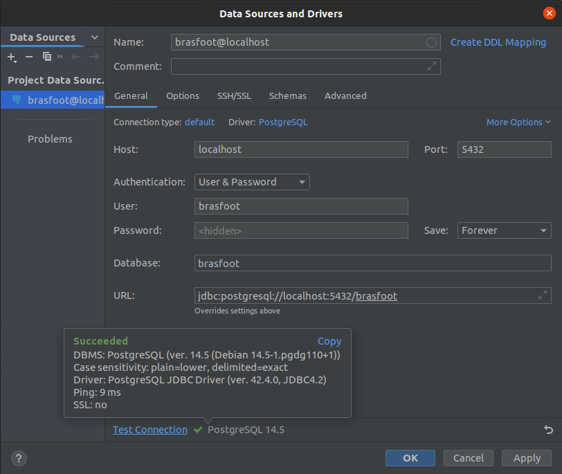

# Instruções para executar o Brasfoot
|    Data    | Versão |      Descrição       |     Autor     |
|:----------:|:------:|:--------------------:|:-------------:|
| 05/09/2022 |  0.1   | Criação do documento | Paulo Gontijo |

## Pré-requisitos
O nosso app, Brasfoot, foi criado usando Docker, ou seja, de forma conteinerizada. Dessa forma, garante-se
que, uma vez que o Docker e Docker-compose for instalado corretamente em qualquer máquina, a aplicação também funcionará.
Portanto, os pré-requisitos para executar o aplicativo são o Docker e o Docker-compose. Segue o link de instalação oficial
dos mesmos:

- [Docker](https://docs.docker.com/desktop/)
- [Docker-compose](https://docs.docker.com/compose/install/compose-desktop/)

## Executar a infraestrutura de ambiente
Uma vez finalizada as devidas intalações mencionadas acima, estamos prontos para executar o app Brasfoot, de forma simples 
e fácil. Vá ao diretório **grupo7-brasfoot/app/** e execute o comando a seguir:

```shell
docker compose up
```

Para inicializar o aplicativo do ponto partida **default**, deve-se verificar a existência de containers associados e,
executar uma limpeza nos volumes dos mesmos. Para tal, execute o comando:

```shell
docker compose down --volumes
```

Em seguida:

```shell
docker compose up --remove-orphans --build --always-recreate-deps
```

## Conectar ao Banco de Dados
Ao executar o comando *docker compose up*, a aplicação ficará disponível na porta 5432 do seu computador, ou seja, no *localhost*.
Com isso, é possível se conectar com o banco de dados através de um sistema gerenciador de bancos de dados (SGBD) de sua preferência.
No nosso exemplo foi usado uma *feature* do PyCharm, mas existem diversos outros. A interafce de SGBD oficial do **Postgres** é o
**pgAdmin 4**, você pode instalá-lo facilmente por este [link aqui](https://www.pgadmin.org/download/).

Os parâmetros de conexão com o banco são mostrados a seguir:

* **Host:** localhost (0.0.0.0)
* **Porta:** 5432
* **Método de autenticação:** Usuário e senha
* **Usuário:** brasfoot
* **Senha:** brasfoot
* **Database:** brasfoot


<h6 align='center'>Figura 1: Exemplo conexão com Postgres</h6>


## Executar o APP
A partir deste ponto, já é possível executar a CLI (*command line interface*) da aplicação. Para tal, você deve ter a
linguagem **Python (versão 3.8+)** instalada em sua máquina. Uma vez validado esse pré-requisito, navegue até a pasta raiz
do projeto para criar um ambiente virutal. O seguinte comando ilustra o processo:

```python
python3 -m venv venv
```

A figura a seguir exemplifica o resultado esperado da estrutura de pastas

<center>


</center>

<h6 align='center'>Figura 2: Exemplo estrutura de pastas</h6>


Após isso, devemos ativar o ambiente virtual, para que todas as instalações sejam feitas sem interferir no sistema globa 
de sua máquina. Para tal, siga o comando a seguir:

```shell
source venv/bin/activate
```


Navegue até o diretório
**grupo7-brasfoot/app/backend** e execute o seguinte comando:

```shell
pip install -r requirements.txt
```

Em seguida, execute o seguinte comando:

```python
python3 main.py
```

Pronto, siga as instruções contidas na CLI e aproveite o jogo!